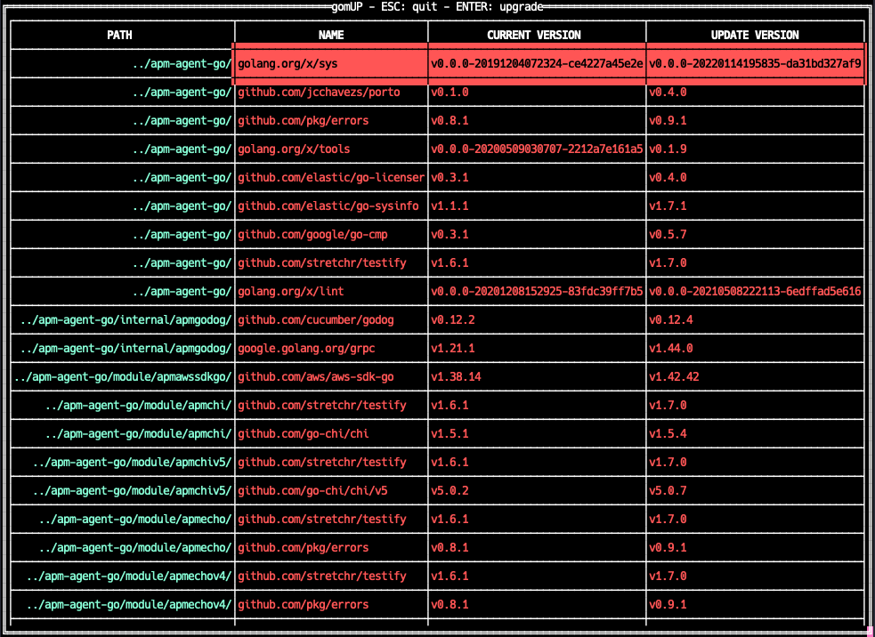

# gomUP 🆙

gomUP is a tool to keep track of outdated dependencies and upgrade them to the latest version. Designed for monorepo Go
projects and Go projects that contain multiple modules.



# Install

Go to the [releases page](https://github.com/alihanyalcin/gomup/releases), and download the binaries for your operating
system (macOS, Linux, and Windows). <br/><br/>
Alternatively, <br/>
You can install it using `go install`:
```
go install github.com/alihanyalcin/gomup@latest
```

# Usage

```
gomup -p <project-directory-path>
```

After you hit the enter, **gomUP** starts to walk through your project directory path to find go modules. It may take a
while to collect all modules and dependencies.
